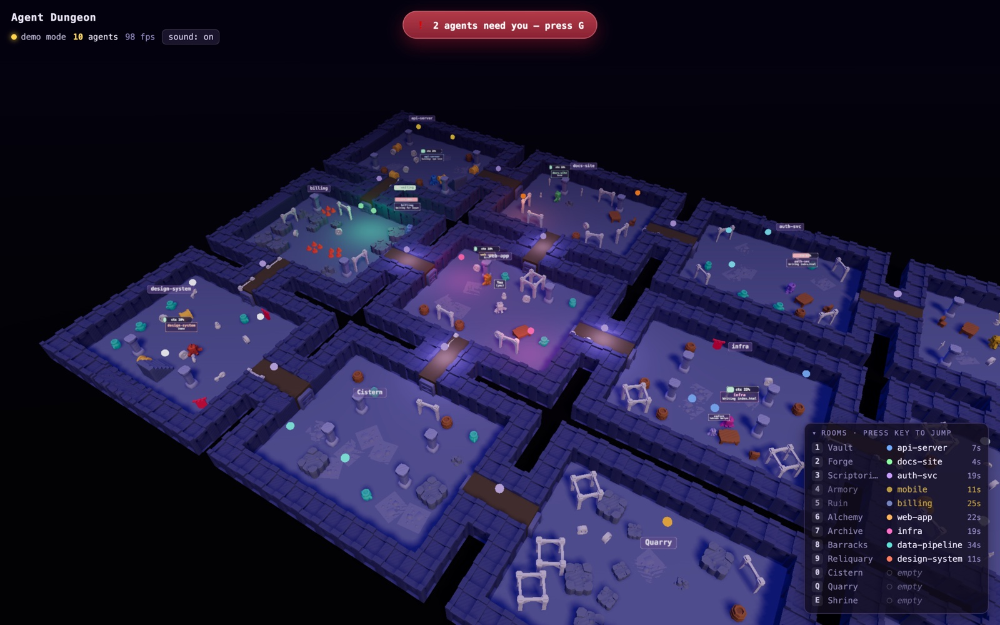
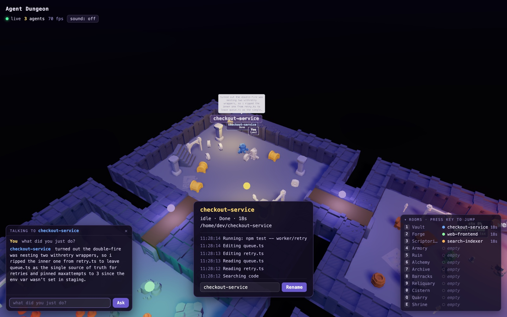
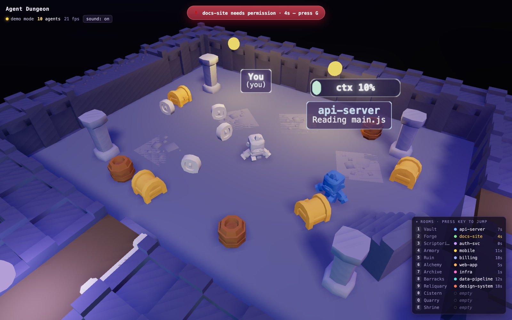

<div align="center">

# 🏰 Claude Dungeon

**Your Claude Code sessions, as a party of adventurers in a torchlit dungeon.**

Every running session becomes a character with its own room. Walk up to one and
ask what it's been doing — and it'll tell you, in plain English.

[](https://github.com/lewismillerg1/claude-dungeon/actions/workflows/ci.yml)
[](LICENSE)
[](package.json)
[](CONTRIBUTING.md)



</div>

---

## Why this exists

Running one Claude Code session is easy. Running **six** is not.

They finish at different times. Two are blocked on a permission prompt you
never saw. One burned through its context window twenty minutes ago. One has
been quietly stuck. And the only way to find out is to cycle through six
terminal tabs and read six walls of scrollback.

A terminal tab is a bad status display. It shows you one agent, only when you're
looking at it, and it tells you nothing at a glance.

Claude Dungeon turns that into a room you can see:

|   | |
|---|---|
| 🧙 **Every session is a character** | Each one gets its own room, named after the folder it's working in. |
| 🔨 **You can see what they're doing** | Reading sends them to a lectern, writing sits them at a table, running tests has them pacing. Posture *is* the status. |
| 📊 **Context burn, over their head** | A live gauge reading straight from the transcript. Green, amber at 40%, red at 60% — you spot the one about to run out before it does. |
| 🔔 **Blocked agents shout** | Anything waiting on you lights its room red and puts a banner on screen. Press <kbd>G</kbd> to jump straight to whoever has been waiting longest. |
| 💬 **Ask them what they did** | Walk over, press <kbd>T</kbd>, and get a real answer built from that session's transcript. |
| 👥 **Sub-agents show up too** | Spawned helpers appear beside their parent and vanish when they're done. |

It is a genuinely useful dashboard that happens to be a dungeon. The frivolity
is the point: you'll actually glance at it.

## See it work

**Walk up and ask.** Press <kbd>T</kbd> next to any agent. You get an instant
answer parsed from the transcript, then a spoken one from a model — here, from a
local Ollama, so nothing left the machine:



Notice it's *specific*. It names `retry.ts` and `queue.ts`, explains the actual
mechanism, and mentions the `maxAttempts` change — because it's summarising real
tool calls and the session's own writeup, not guessing from a job title.

**Everything at a glance.** Name, current activity, and context gauge float over
each agent. The roster in the corner maps every room to a hotkey:



## Get it running

Three commands. The whole thing is local.

```bash
git clone https://github.com/lewismillerg1/claude-dungeon.git
cd claude-dungeon
npm install
npm run dev
```

Open **http://127.0.0.1:5173** and you'll see an empty dungeon. To populate it,
register the Claude Code hooks:

```bash
npm run hooks:install
```

Now open a **new** Claude Code terminal — hooks load when a session starts, so
existing sessions won't appear — and it'll walk into the dungeon.

That's it. To undo everything:

```bash
npm run hooks:uninstall
```

> `hooks:install` backs up `~/.claude/settings.json` before its first change and
> only ever touches its own entries, so your other hooks are left alone.

**Just want a look first?** No install, no hooks:

```
http://127.0.0.1:5173/?demo
```

### Requirements

- Node `^20.19.0 || >=22.12.0`
- [Claude Code](https://claude.com/claude-code)
- *Optional*, for spoken answers: an `ANTHROPIC_API_KEY`, or a local
  [Ollama](https://ollama.com). Without either, everything still works — you
  just get the instant offline answers instead of the spoken ones.

## Controls

| Key | |
|---|---|
| <kbd>W</kbd><kbd>A</kbd><kbd>S</kbd><kbd>D</kbd> / arrows | move |
| <kbd>Space</kbd> | inspect the agent you're standing next to |
| <kbd>T</kbd> | open/close the chat · <kbd>Esc</kbd> to close |
| <kbd>G</kbd> | jump to whoever has been waiting longest |
| <kbd>N</kbd> | set your name |
| <kbd>1</kbd>–<kbd>9</kbd>, <kbd>0</kbd>, letters | fast-travel to a room |
| <kbd>+</kbd> / <kbd>-</kbd>, scroll | zoom |

Click an agent to inspect it. Rename it in the detail panel and the name sticks
across refreshes — its room takes the name too.

## How it works

```
Claude Code session
      │  lifecycle hooks (SessionStart, PreToolUse, Stop, …)
      ▼
agents/hook.mjs ──POST /agent-event──► Vite dev server (agentRelay plugin)
                                            │
                                            │  WebSocket /agent-ws
                                            ▼
                                       browser (three.js dungeon)
```

`agents/hook.mjs` is registered as a Claude Code hook. On every lifecycle event
it forwards the event JSON to the relay inside the Vite dev server, which tracks
per-session state, reads context usage out of the transcript, and broadcasts to
the browser. It never blocks Claude Code: the hook is fire-and-forget with a
1.5-second bail, and every failure path exits 0.

Answers come in two tiers:

1. **Instant, free, offline.** Facts parsed from the transcript — which files
   were touched, how many commands ran.
2. **A spoken line from a model,** streamed as it generates. First available
   wins: `ANTHROPIC_API_KEY` → Claude API (~1–2s), else a reachable local Ollama
   (~5–12s, free, offline), else nothing and tier 1 stands on its own.

Tier 2 is skipped entirely when the transcript is too thin to summarise
honestly, rather than letting a model invent a plausible-sounding turn.

## What leaves your machine

**Worth reading before you install the hooks.**

Tier 1 is entirely local. **Tier 2 is not.** When you ask an agent a question and
`ANTHROPIC_API_KEY` is set, this goes to the Anthropic API:

- the prompt you gave that session
- the names of files it touched
- the first line of each shell command it ran (up to 6, truncated to 80 chars)
- up to 2,500 characters of Claude's own closing writeup for that turn
- your question

Want nothing to leave? **Unset `ANTHROPIC_API_KEY`** for the process running
`npm run dev` and use Ollama — that path is fully local, and it's what produced
the screenshot above. With neither configured the app stays on tier 1.

The only background call is one pre-warmed answer to "what did you just do?",
generated when a session stops so the reply is instant when you walk over. That
too only happens when a tier-2 backend is configured.

## Security

This is a **local** tool and it assumes one trusted user on `127.0.0.1`. The
relay holds your sessions' working directories, activity, and enough transcript
to summarise a turn — with no authentication.

- Binds to `127.0.0.1` only.
- The WebSocket and event endpoint both check `Origin` and reject anything that
  isn't loopback. WebSockets are exempt from the same-origin policy, so without
  that check a page you merely *visited* could read your session data.
- **Don't expose it.** No `--host`, no tunnel, no reverse proxy.

Full detail — and how to report a vulnerability — in [SECURITY.md](SECURITY.md).

## Configuration

All optional.

| Variable | Default | |
|---|---|---|
| `ANTHROPIC_API_KEY` | — | enables the Claude API backend for tier 2 |
| `AGENTS_ANTHROPIC_MODEL` | `claude-opus-5` | model for the Claude API backend |
| `AGENTS_OLLAMA_URL` | `http://127.0.0.1:11434` | local Ollama endpoint |
| `AGENTS_OLLAMA_MODEL` | `hf.co/unsloth/Qwen3.5-9B-GGUF:Q4_K_M` | local model |
| `AGENTS_LLM_TIMEOUT_MS` | `45000` | tier-2 generation timeout |
| `AGENTS_CONTEXT_WINDOW` | auto-detected | override the assumed context window |
| `AGENTS_PORT` | `5173` | port the hook posts events to |

Query parameters: `?demo` for fake sessions, `?seed=123` to regenerate the
layout (`?seed=0` for the reference one). The layout is otherwise stable across
refreshes, because rooms are bound to sessions in `localStorage`.

## Scripts

| | |
|---|---|
| `npm run dev` | dungeon + relay — the one you want |
| `npm run build` | static build (no relay, so no live agents) |
| `npm run preview` | serve the build *with* the relay attached |
| `npm test` | context-window math against your real transcripts |
| `npm run hooks:install` / `hooks:uninstall` | manage the Claude Code hooks |

## Contributing

Issues and pull requests are welcome — see [CONTRIBUTING.md](CONTRIBUTING.md)
for how to get set up and the handful of things that are easy to get wrong.
Everyone participating is expected to follow the
[Code of Conduct](CODE_OF_CONDUCT.md).

You don't need the hooks installed to work on the renderer: `?demo` exercises
every state, including sub-agents spawning and sessions blocking on permission.

## Credits

3D models from [Kenney](https://kenney.nl)'s asset packs (CC0).
Built with [three.js](https://threejs.org) and [Vite](https://vite.dev).

## License

Open source under the [MIT License](LICENSE) — use it, fork it, ship it.
